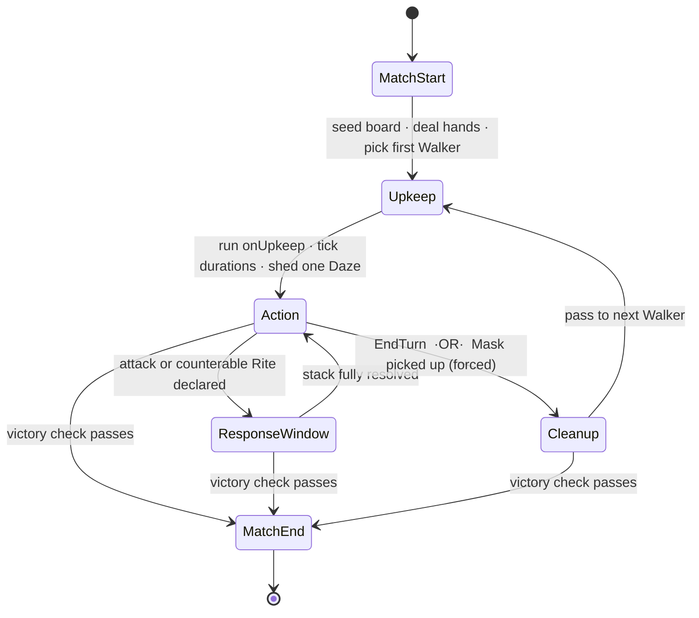
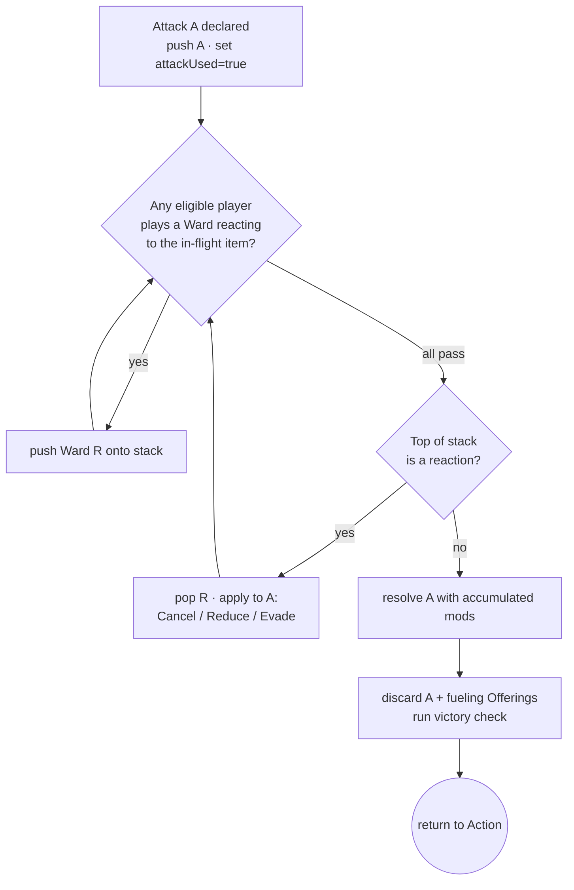

# HOLLOWFALL — Engine State Machine & Resolution Order (v0.1)

Companion to `HOLLOWFALL_spec.md` (§5, §8, §13.1) and `HOLLOWFALL_effect_dsl.md`
(§7 reactions). Defines the authoritative turn FSM, the nested Ward response-window,
the exact attack→ward→resolve algorithm, and when the victory check fires. Layer A.

---

## 1. Top-level turn FSM

The engine is an authoritative FSM. Clients submit **intents**; the server validates
each against the current state's legal-intent set (§7), mutates state, and emits
deltas. One Walker is **active** per turn; play proceeds clockwise.



The **victory check** (§5) is a guard evaluated on every transition that can follow a
points-change or an elimination; if it passes, the machine jumps to `MatchEnd`
instead of continuing.

---

## 2. State-by-state

### 2.1 MatchStart (engine-driven, seeded)
1. Build the Hollow: shuffle + rotate Grounds, assemble for player count (spec §3).
2. Place Walkers on Hearths; place two Masks per Walker on its spawn cells.
3. Build the draw pile from the chosen Paths; shuffle.
4. Deal 5 Rites to each Walker.
5. Choose first Walker.
All randomness draws from the seeded PRNG in this fixed order (§6).

### 2.2 Upkeep (active Walker; automatic, ordered)
Execute strictly in this order, then advance to Action:
1. **Resolve `onUpkeep` triggers** of the active Walker's maintained Rites (DSL §6),
   in the order the Rites were cast (stable).
2. **Tick durations:** remove one Breath token from each *temporary* maintained Rite;
   any reaching 0 run their `onEnd` and are discarded.
3. **Shed one Daze:** if the active Walker holds Daze tokens, discard one and set
   `dazedThisTurn = true` for this turn (§3 constraint).

> An `onUpkeep` effect that deals damage can sever a Walker → fire the victory check
> before continuing to step 2/3.

### 2.3 Action (active Walker; interactive)
Budget: `mp = baseSpeed (3)`, `attackUsedThisTurn = false`, plus the once-per-turn
`quickenUsed = false`. Legal intents in §7. Order is free; the player interleaves
movement, one attack, and non-attack Rites until they end the phase.

**Forced transitions out of Action:**
- **Pick up a Mask → go straight to Cleanup** (spec §6.2). This is the steal's cost.
- **EndTurn** intent → Cleanup.

**Daze constraint** (when `dazedThisTurn`): the Walker may *move or attack, not both*.
- After any voluntary `MoveStep`, block `DeclareAttack`.
- After `DeclareAttack`, block voluntary `MoveStep` and any self-move effect.
(Non-attack Rites, pickups, etc. remain legal.)

**Form speed mid-turn:** a `Transform` that changes `baseSpeed` adjusts remaining `mp`
by the delta (may go ≤0; spec §6). Recompute `mp` immediately on transform.

### 2.4 ResponseWindow (nested; see §4)
Entered when the active Walker declares an attack (or plays a Rite a Ward can react
to). Runs the stack-resolution loop, then returns to Action with the outcome applied.

### 2.5 Cleanup (active Walker)
1. **Discard:** any number of cards (optional).
2. **Draw:** up to 2, never exceeding hand limit 7. Empty pile → reshuffle discard
   (seeded).
3. **Over-limit check:** if hand > 7 (from a sever absorb, an effect), discard down to 7.
4. Pass active status to the next living Walker clockwise → their Upkeep.

### 2.6 MatchEnd
Freeze state, declare winner (or draw, §5), persist the seed + intent log for replay.

---

## 3. Action budget & flags (engine state per turn)

| Flag | Set when | Effect |
|---|---|---|
| `mp` | start of Action = baseSpeed; ± on transform; + on Quicken | gates movement/pickups |
| `attackUsedThisTurn` | the instant an attack is **declared** | blocks a second attack even if the first is canceled |
| `quickenUsed` | first Quicken | blocks a second speed boost |
| `dazedThisTurn` | Upkeep, if Daze shed | enforces move-XOR-attack (§2.3) |
| `firstTurn` | a Walker's first turn of the match | blocks `DeclareAttack` |

`attackUsedThisTurn` is set on **declaration**, before any Ward resolves — a fully
canceled attack still consumes the turn's attack (spec §8.2).

---

## 4. The Response Window (stack + priority)

Modeled as a **LIFO stack** with a priority round between resolutions — general enough
to handle Ward-on-Ward chains, while collapsing to the simple "defender stacks a few
Wards" case.



**Eligibility:** a Ward may be added only if its `reactsTo` predicate (DSL §7) matches
the current in-flight item bound to `$incoming`. In the base game only the attack's
target reacts; the priority loop also admits future "counter the counter" cards
without changing the engine.

**Chain depth:** capped at `MAX_WARD_CHAIN` (config, default 8) to bound recursion.

### 4.1 Resolution algorithm (authoritative pseudocode)

```text
function resolveAttack(attacker, card, declaredTarget):
    attacker.attackUsedThisTurn = true            # on declaration
    A = AttackItem(card, target=declaredTarget,
                   damageReduction=0, durationReduction=0,
                   canceled=false, evadedBy={})
    stack = [A]

    loop:
        # --- priority round: collect reactions until all pass ---
        while (W = anyEligiblePlayerPlaysWard(top=stack.peek)) is not null
              and depth(stack) < MAX_WARD_CHAIN:
            stack.push(Reaction(W, owner))

        # --- resolution step ---
        if stack.peek() is Reaction R:
            stack.pop()
            switch R.response.op:
                Cancel:  A.canceled = true
                Reduce:  if R.what == "damage":   A.damageReduction   += value(R.by)
                         if R.what == "duration": A.durationReduction += value(R.by)
                Evade:   if rollSucceeds(R.onRoll, rng): A.evadedBy.add(R.owner)
            continue loop          # reopen priority; defender may add more
        else:
            break                  # only base A remains

    # --- apply A ---
    if not A.canceled and A.target not in A.evadedBy:
        applyAttackEffect(A)       # see 4.2
    discard(card, fuelingOfferings)
    runVictoryCheck()
```

### 4.2 Applying the resolved attack

```text
function applyAttackEffect(A):
    dmg = max(0, baseDamage(A) - A.damageReduction)
    dur = max(0, baseDuration(A) - A.durationReduction)
    if dmg > 0:
        DealDamage(A.target, dmg, traits)         # engine then runs trait rules:
                                                  #  fire → destroy target bonecharms
                                                  #  3-dmg-per-crack on objects
        if dur > 0: applySecondaryEffects(A, energy=dur)   # curses, statuses, etc.
    else:
        # reduced to 0 → no damage AND no on-hit secondary effects (spec §8.2)
        if isPureStatus(A) and dur > 0: applySecondaryEffects(A, energy=dur)
    if lethal(A.target):                          # thread <= 0
        if A is a direct attack: scoreSever(attacker); absorbHand(attacker, A.target)
        else:                    discardHand(A.target)        # indirect: no score
        eliminate(A.target)
```

Key consequences that fall out of LIFO + reopened priority:
- A **Cancel** anywhere makes later reduces/evades harmless no-ops (base never applies).
- **Reduces** accumulate additively across multiple Wards.
- **Evade** is per-defender; a successful evade removes the effect on that defender only.
- Damage reduced to 0 suppresses secondary on-hit effects; duration reduced to 0
  cancels a duration effect.

---

## 5. Victory check (the hook)

```text
function runVictoryCheck():
    living = [w for w in walkers if w.alive]
    # eliminated Walkers are never eligible winners (handles death-before-win)
    for w in turnOrder:
        if w.alive and w.points >= MATCH_TARGET: return endMatch(winner=w)
    if len(living) == 1: return endMatch(winner=living[0])
    if len(living) == 0: return endMatch(draw=true)     # simultaneous wipe
    # else: continue play
```

**Fires after** any of: a sever or any elimination; a Mask entering or leaving a
Hearth; any other point change. In FSM terms it's the guard on the `--> MatchEnd`
transitions in §1.

**Death-before-win (spec §2):** when a single resolution would both eliminate the
acting Walker *and* grant them a point/win (e.g. an indirect death triggered while
scoring), process `eliminate()` **first**, then `runVictoryCheck()`. Because the check
only considers `w.alive`, the just-eliminated Walker cannot be declared winner.

---

## 6. Determinism & RNG draw order

All randomness comes from one seeded PRNG. To keep replays exact, draws happen in a
**fixed, logged order** at these points only:
1. MatchStart: Ground shuffle → Ground rotations → deck shuffle → first-Walker pick.
2. Per draw: card draws in Cleanup (and any forced draws), in resolution order.
3. Deck reshuffles (when the pile empties).
4. `Evade` rolls (§4.1), `ForceRandomMove` directions, and any in-card `roll` —
   drawn at the moment the op resolves.

Persist `{seed, orderedIntentLog}`; replaying the intents against the seed reproduces
the match bit-for-bit (spec §13.2).

---

## 7. Legal intents per state (validation)

| State | Intent | Validation |
|---|---|---|
| Action | `MoveStep(dir)` | `mp ≥ 1`, not blocked; if `dazedThisTurn` & attacked → reject |
| Action | `Quicken(card)` | `!quickenUsed`, card has Breath value |
| Action | `PlayRite(card, target)` | non-attack type; legal target/range (DSL §3–4) |
| Action | `DeclareAttack(src, target)` | `!attackUsedThisTurn`, `!firstTurn`; if dazed & moved → reject; opens ResponseWindow |
| Action | `PickUpObject(obj)` | object in cell, mobile, `mp ≥ 1`, room in hand |
| Action | `PickUpMask(mask)` | mask in cell, `!carriedMask` → **forces Cleanup** |
| Action | `DropTalisman` / `DropMask` | item carried; free |
| Action | `EndMaintained(rite)` | rite maintained by this Walker |
| Action | `EndTurn` | always → Cleanup |
| ResponseWindow | `PlayWard(card)` | `reactsTo` matches `$incoming`; under chain cap |
| ResponseWindow | `Pass` | always |
| Cleanup | `Discard(cards)` | cards in hand |
| Cleanup | `Draw(n)` | `n ≤ 2`, `hand + n ≤ 7` |
| Cleanup | `ConfirmEnd` | always → next Upkeep |

Anything not listed for a state is rejected. The server is authoritative; clients
never resolve.

---

## 8. Edge-case timing (collected)

- **Canceled attack still costs the turn's attack** — set on declaration (§3).
- **Indirect death scores nobody** and discards the victim's hand (§4.2).
- **Empty draw pile** reshuffles the discard mid-Cleanup before completing the draw.
- **Transform mid-turn** recomputes `mp` immediately; can strand a Walker at `mp ≤ 0`.
- **Mask never blocks LOS or counts vs hand limit** (spec §6.2) — engine treats it as
  carrier-attached state, not an object/card.
- **Simultaneous elimination** to 0 living → draw; to 1 living → that Walker wins even
  if the killing blow also eliminated others.

---

## 9. Open items

- Should the attacker get priority to respond to a defender's Ward in the base game?
  Current model: no (only the target reacts), but the priority loop supports it via a
  per-card flag if a future Path wants "counter the counter."
- Final value of `MAX_WARD_CHAIN` and `MATCH_TARGET` (defaults 8 / 2) — confirm in
  playtest.
- Live-play turn timer + auto-pass policy for an unresponsive defender in the
  ResponseWindow (auto-Pass on timeout is the safe default).

*End of Engine State Machine v0.1.*
