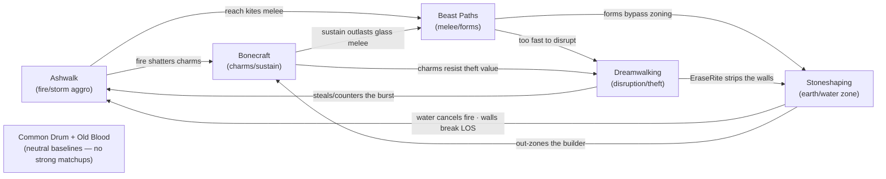

# HOLLOWFALL — Paths & Balance Framework (v0.1)

Companion to all prior docs. Item #5. Rather than dump ~140 finished cards, this gives
the **shared balance budget** every Path authors against, the **identity + one
signature card** for each of the six remaining Paths, the **counterplay web**, and a
**reconciliation** of the built Ashwalk slice against the budget. The remaining mass
authoring then becomes fill-in-the-blanks against a fixed rate card. Layer B content;
numbers are playtest placeholders.

> **Honesty note:** matchup spreads and exact numbers below are a *designed starting
> hypothesis*, not measured balance. They can't be verified without playtest; treat the
> web and the rate card as the thing to test, not a result.

---

## 1. The balance budget (the rate card all Paths share)

### 1.1 Baseline unit
The "fair line": an **instant, single-target, LOS Bane deals damage = energy**
(Ashwalk's Ember Bolt). That is **1.0 damage per Breath** at standard terms. Every
other effect is priced as a discount/premium against this.

### 1.2 Rate card (adjustments to the baseline)

| Lever | Direction | Rule of thumb |
|---|---|---|
| Range `adjacent`-only | **discount** (you must close) | +1 flat or +25% damage |
| Range `anywhere`/`global` | **premium** | −1 flat or higher Breath floor |
| AoE / multi-target | **tax** | per-head damage below baseline (e.g. 2nd target at `energy−1`) |
| `mundane` (uncounterable) | **premium** | lower numbers; can't be Warded |
| Duration / `curse` | **discounted burst, taxed by counterplay** | total ≈ `energy`, but delayed & dispellable |
| Self-cost / recoil | **discount** | Immolate gets `energy×2` for biting the caster |
| Conditional bonus | **discount until set up** | Pounce: `energy`, or `energy+2` only in-form |
| Non-damage utility | priced in tempo/cards | Heal ≈ 1.0 Thread/Breath; Steal swings 2 cards → costs the whole action, no damage |

### 1.3 The hand-pressure lever (the big one)
Maintained Rites and carried Talismans share the **7-card hand limit** (spec §4). So a
Path's power is *self-taxed by how much it keeps in play*: every standing wall, charm,
or curse is −1 live card. This is the primary knob that lets control Paths run strong
effects without dominating — they choke their own draw.

- **Low maintained density** (Ashwalk, Beast, Common): near-full hand, high tempo.
- **High maintained density** (Stoneshaping, Bonecraft): strong board/standing effects,
  but a chronically smaller working hand.

### 1.4 Clock targets (so numbers can be sanity-checked)
Against 15 Thread, counters reducing some damage:

| Archetype | Intended win path | Rough clock |
|---|---|---|
| Aggro (Ashwalk, Beast) | sever via burst | 3–4 unanswered turns |
| Disruption (Dreamwalking) | strip + grind, sever or Mask | 6–8 turns |
| Control/Zone (Stoneshaping, Bonecraft) | survive, win on **Masks** not kills | open-ended |
| Fair (Old Blood, Common) | flexible | 5–7 turns |

---

## 2. The counterplay web

A regular tournament over the five specialists: **each is favored into two and
unfavored into two**, every edge thematically grounded. Common Drum and Old Blood sit
*outside* the web as deliberately neutral baselines so the meta isn't pure RPS.



Arrow `X --> Y` means **X is favored into Y**. Each node has out-degree 2 and in-degree
2 — balanced by construction (verify by playtest).

---

## 3. The six remaining Paths

Each block: identity · pillars (systems it leans on) · matchups · hand-pressure ·
signature card (full DSL) · any DSL/engine gap it surfaces.

### 3.1 Common Drum  *(universal — in every deck)*
- **Identity:** the rites every Walker knows; reliability and glue, no specialization.
- **Pillars:** basic movement, a baseline Ward, a door Key, light Heal, fuel.
- **Matchups:** neutral — it's everyone's baseline.
- **Hand-pressure:** low. **Win path:** none alone; it patches gaps.
- **Surfaces:** nothing new.

```jsonc
// Knit the Thread — the universal sustain: heal self or an adjacent ally for energy.
{ "id":"com_knit_thread","name":"Knit the Thread","type":"working","path":"common",
  "range":"adjacent","targetKind":"walker","duration":"instant","baseBreath":1,"breathValue":1,
  "onCast":{ "op":"Heal","to":"$target","amount":"$energy" } }
```

### 3.2 Bonecraft  *(charms & sustain)*
- **Identity:** carved bone/stone charms granting standing boons — durable, attritional,
  fragile to fire.
- **Pillars:** `bonecharm` Talismans, `onUpkeep` sustain, `maxThread` buffs.
- **Favored into:** Beast (out-sustains glass melee), Dreamwalking (charms already in
  play resist theft). **Unfavored into:** Ashwalk (fire shatters charms), Stoneshaping
  (out-zoned).
- **Hand-pressure:** **high** — every charm is a permanently-held card.
- **Surfaces:** nothing new (maintained `onUpkeep` on a permanent Talisman is legal).

```jsonc
// Gravesalt Charm — +2 max Thread and heal 1 each upkeep while carried. Dies to fire.
{ "id":"bon_gravesalt_charm","name":"Gravesalt Charm","type":"talisman","path":"bonecraft",
  "traits":["bonecharm"],"range":"self","targetKind":"self","duration":"permanent",
  "baseBreath":1,"breathValue":2,
  "onCast":  { "op":"ModifyStat","target":"$caster","stat":"maxThread","delta":2,"duration":"whileCarried" },
  "onUpkeep":{ "op":"Heal","to":"$caster","amount":1 } }
```

### 3.3 Stoneshaping  *(earth/water zoning)*
- **Identity:** shapes the Hollow itself — walls, thorns, springs. Board control; carries
  the `water` answers to fire.
- **Pillars:** `CreateWall`/`CreateObject`, `fillsCell` LOS-blockers, `onEnter` hazards,
  `water` trait.
- **Favored into:** Ashwalk (water + walls), Bonecraft (out-zones). **Unfavored into:**
  Beast (mobility/forms bypass), Dreamwalking (EraseRite strips the walls).
- **Hand-pressure:** **high** — standing terrain is maintained.
- **Surfaces:** **DSL gap — `$enterer` binding.** `onEnter` needs a handle on *who*
  walked in. Recommend adding `$enterer` (and symmetric `$trigger` for `onHitBy`) to the
  DSL context (§2). Also registers a new `thornbush` object id.

```jsonc
// Bramble Maw — a thorn that fills its cell (blocks LOS+move) and bites anyone entering.
{ "id":"sto_bramble_maw","name":"Bramble Maw","type":"working","path":"stoneshaping",
  "traits":["creation"],"range":"los","targetKind":"cell","duration":"permanent",
  "baseBreath":1,"breathValue":2,
  "onCast": { "op":"CreateObject","cell":"$cell","object":"thornbush","fillsCell":true },
  "onEnter":{ "op":"DealDamage","to":"$enterer","amount":2 },
  "onEnd":  { "op":"DestroyObject","object":{ "select":"objects","where":{ "is":["$it","thornbush"] } } } }
```

### 3.4 Dreamwalking  *(disruption & theft)*
- **Identity:** spirits of mind and dream — steal and erase rites, deny resources, win
  the long game on cards.
- **Pillars:** `StealCard`, `EraseRite`, status control, plentiful small Offerings.
- **Favored into:** Ashwalk (counters/steals the burst), Stoneshaping (erases the walls).
  **Unfavored into:** Beast (dies before disruption lands), Bonecraft (charms already
  resolved).
- **Hand-pressure:** low–medium; it *adds* to its own hand by stealing.
- **Surfaces:** *(future)* a Ward that **steals** the countered card instead of
  discarding it would need a richer `response` than Cancel/Reduce/Evade — flag, not
  needed for the signature.

```jsonc
// Pilfer — take one card of your choice from a rival you can see. The Path's swing.
{ "id":"dre_pilfer","name":"Pilfer","type":"working","path":"dreamwalking",
  "range":"los","targetKind":"walker","duration":"instant","baseBreath":1,"breathValue":1,
  "onCast":{ "op":"StealCard","from":"$target","count":1,"pickBy":"$caster" } }
```
Companion tool (not shown in full): **Unwork** — `EraseRite` a maintained enemy Rite;
this is the hard answer to Stoneshaping's and Bonecraft's standing cards.

### 3.5 Beast Paths  *(forms & melee)*
- **Identity:** take animal shapes — fast, physical, mobile; one form at a time, each with
  a weakness.
- **Pillars:** `Transform`/`EndForm`, `isForm` conditionals, melee tempo.
- **Favored into:** Dreamwalking (speed), Stoneshaping (forms bypass zoning). **Unfavored
  into:** Ashwalk (kited at range), Bonecraft (out-sustained).
- **Hand-pressure:** low (a form is a single maintained card enabling many others).
- **Surfaces:** **new content type — a Form-definition schema.** Forms are stat/ability
  overlays (baseSpeed delta, granted abilities, the form's weakness), not cards — they
  need their own registry + schema, validated like cards. Add to the item #4 pipeline.

```jsonc
// Pounce — adjacent strike; energy normally, but energy+2 while you wear the Wolf.
{ "id":"bea_pounce","name":"Pounce","type":"bane","path":"beastpaths",
  "range":"adjacent","targetKind":"walker","duration":"instant","baseBreath":1,"breathValue":2,
  "onCast":{ "op":"If",
    "cond":{ "isForm":["$caster","wolf"] },
    "then":[ { "op":"DealDamage","to":"$target","amount":{ "add":["$energy",2] } } ],
    "else":[ { "op":"DealDamage","to":"$target","amount":"$energy" } ] } }
```
Enabler (not shown in full): **Wear the Wolf** — `working`, `permanent`, trait `form`,
`Transform → wolf` (a fast, fragile melee form whose weakness is reach/kiting).

### 3.6 Old Blood  *(ancestral generalist)*
- **Identity:** the deepest, most balanced tradition — consistency, card flow, fat fuel,
  a little of everything.
- **Pillars:** `DrawCard` advantage, high-value Offerings, flexible mid-range Banes/Wards.
- **Matchups:** neutral — no hard win or loss; the new-player Path.
- **Hand-pressure:** low–medium. **Win path:** flexible mid-range, often closes on Masks.
- **Surfaces:** nothing new (`DrawCard` capped by the hand limit at the engine).

```jsonc
// Elder's Counsel — draw energy cards (engine clamps to the 7-card hand limit).
{ "id":"old_elders_counsel","name":"Elder's Counsel","type":"working","path":"oldblood",
  "range":"self","targetKind":"self","duration":"instant","baseBreath":1,"breathValue":2,
  "onCast":{ "op":"DrawCard","who":"$caster","count":"$energy" } }
```

---

## 4. First balance pass — reconciling Ashwalk against the budget

Running the built slice (`HOLLOWFALL_path_ashwalk.md`) through §1:

| Card | Budget read | Verdict |
|---|---|---|
| Ember Bolt (`energy`) | the baseline unit itself | ✅ anchor |
| Firebrand (`energy+2`) | flat premium; pays its higher `breathValue` (3) | ✅ |
| Chain Lightning (`energy` + `energy−1`) | AoE tax applied to the 2nd head | ✅ |
| Scorch (1/upkeep ×`energy`) | duration discount; total ≈ `energy`, dispellable | ✅ |
| Thunderclap (self-AoE `energy` + Daze) | positional tax (must be surrounded); Daze may be hot | ⚠ watch Daze in 1v1 |
| Immolate (`energy×2`, 1 recoil) | self-cost discount — but ceiling is high | ⚠ see below |
| Flame Ward (−`energy+1`) + Backlash (50% evade) | two strong defensive cards on a Path meant to be fragile | ⚠ may over-defend |

**Two concrete tuning calls for the playtest:**
1. **Immolate ceiling.** Fueled `energy×2` + Mantle `+1` can two-card a 15-Thread Walker.
   That may be correct for a glass cannon, or want an energy cap on the `×2`. Decision,
   not a bug.
2. **Ashwalk's defense.** A fragile aggro Path with both a big reducer and a coin-flip
   evade may survive too long; consider cutting one Ward copy or raising Backlash's
   evade threshold, so Ashwalk lives and dies by its clock as intended.

Both are exactly the kind of thing the rate card exists to *surface* — neither breaks
the framework; they're dials.

---

## 5. New backlog raised by #5 (feeds items #1 and #4)

1. **`$enterer` / `$trigger` context bindings** (DSL §2) for `onEnter` / `onHitBy` — so
   hazards can act on whoever triggered them. (Stoneshaping.)
2. **Form-definition schema + registry** (item #4 pipeline) — forms are overlay data
   (speed delta, abilities, weakness), validated like cards. (Beast Paths.)
3. **New object ids** to register: `thornbush` (and the broader Stoneshaping terrain set).
4. *(Future)* richer Ward `response` (e.g. steal-on-counter) for Dreamwalking, and the
   retaliate-Ward flagged by Ashwalk — both deferred until a Path actually needs them.

---

## 6. Where the spec stands

With #1–#5 done, HOLLOWFALL has a coherent, buildable skeleton end-to-end: rules →
effect language → engine FSM → a proven content slice → a validation pipeline → all
seven Path identities with a shared balance budget and a counterplay web. What remains
is **execution, not design**: author the ~140 remaining cards against this rate card,
build the engine to the FSM, and replace every placeholder number with a playtested one.

*End of Paths & Balance Framework v0.1.*
